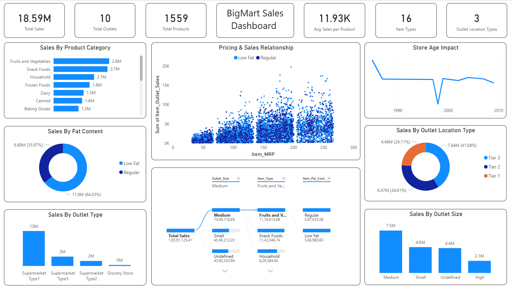

# 📊 BigMart Sales Dashboard (Power BI)

## 🚀 Project Overview  
An interactive Power BI dashboard analyzing BigMart sales data to uncover insights on product performance, pricing impact, and outlet trends.

---

## 📷 Dashboard Preview  


---

## 🛠️ Tech Stack  
<p align="center">
  
  
  
  
</p>

---

## 📌 Key Metrics  
- 💰 Total Sales: 18.59M  
- 🏪 Total Outlets: 10  
- 📦 Total Products: 1559  
- 📊 Avg Sales per Product: 11.93K  
- 🧾 Item Types: 16  
- 📍 Outlet Location Types: 3  

---

## 📈 Key Insights  

### 🥗 Product Performance  
- Fruits & Vegetables and Snack Foods drive maximum revenue  
- Lower contribution from Baking Goods and Canned items  

### 💸 Pricing Impact  
- Strong positive relationship between Item MRP and Sales  

### 🏬 Outlet Analysis  
- Supermarket Type 1 contributes ~70% of total sales  

### 📍 Location Insights  
- Tier 3 cities dominate sales  

### 🧈 Customer Preference  
- Low Fat products contribute ~64% of total sales  

### 📦 Outlet Size  
- Medium-sized outlets perform best  

---

## 📂 Project Structure  
```
BigMart-Sales-Dashboard/
│-- README.md
│-- Dataset/
│ └── bigmart_sales.csv
│-- images/
│ └── dashboard.png
```
---

## 🎯 Key Learnings  
- Built end-to-end dashboard with business KPIs  
- Strong data storytelling & visualization  

---

## ⭐ If you like this project  
Give it a star ⭐ and connect with me on LinkedIn!
